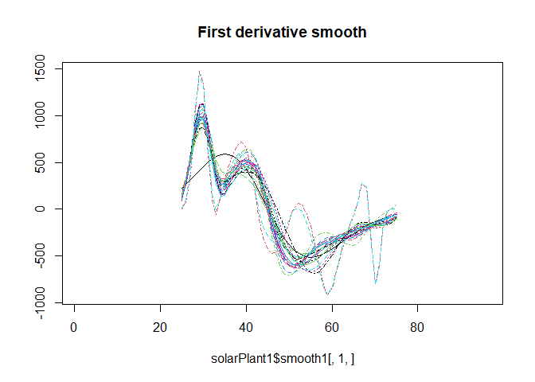

# smartOASYS

## Overview

This package implements methodologies for smart meters data.

## Installation

``` r
#install the package
#devtools::install_github("aefdz/smartOASYS")
devtools::load_all()
```

``` r
#load the package
library(smartOASYS)
```

## Test usage

Load the example data and plot it.

``` r
data("solarPlant1")


matplot(solarPlant1$raw0[,1,], type = "l", main = "Raw")
```


``` r
matplot(solarPlant1$smooth0[,1,], type = "l", main = "Zero derivative smooth")
```


``` r
matplot(solarPlant1$smooth1[,1,], type = "l", main = "First derivative smooth")
```



## References

Elías, A., Morales. J. M. and Pineda, S. (2021). Depth-based Outlier
Detection for Grouped SmartMeters: a Functional Data Analysis Toolbox.
\[link\]<link>.
