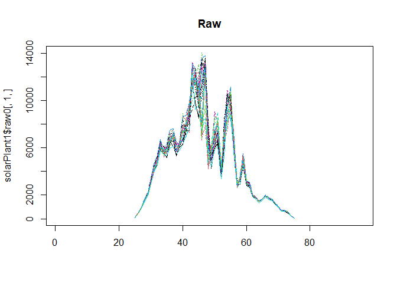
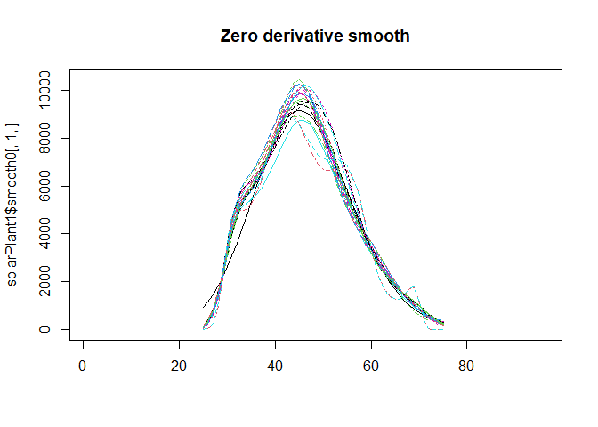
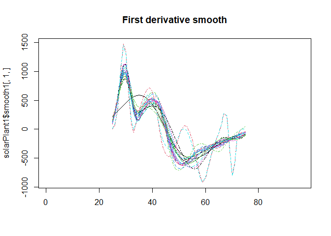
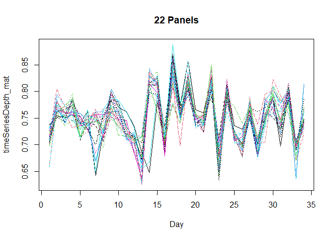
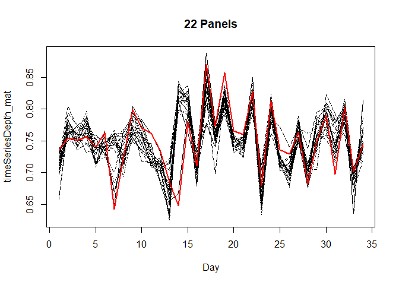

# smartOASYS

## Overview

This package implements methodologies for smart meters data.

## Installation

``` r
#install the package
devtools::install_github("aefdz/smartOASYS")
```

``` r
#load the package
library(smartOASYS)
```

## Test usage

Load the example data and plot one day for the 22 inverters.

``` r
data("solarPlant1")


matplot(solarPlant1$raw0[,1,], type = "l", main = "Raw")
```

<!-- -->

``` r
matplot(solarPlant1$smooth0[,1,], type = "l", main = "Zero derivative smooth")
```

<!-- -->

``` r
matplot(solarPlant1$smooth1[,1,], type = "l", main = "First derivative smooth")
```

<!-- -->

## High dimensional outlier detection

Compute time series of depths and scaled depths

``` r
data <- aperm(solarPlant1$smooth0, c(3,1,2))

depthsTime <- timeDepth(data, typeDepth = "FMD")
```

Compute the prototype, the distances to the prototype and the outlier
detection rule

``` r
# Depths
timeSeriesDepth_mat <- matrix(unlist(depthsTime[1,]), ncol = dim(data)[1], nrow = dim(data)[3])
colnames(timeSeriesDepth_mat) <- dimnames(data)[[1]]

# Scaled Depths
#timeDepth_mat <- matrix(unlist(depthsTime[2,]), ncol = dim(data)[1], nrow = dim(data)[3])
#colnames(timeDepth_mat) <- dimnames(data)[[1]]
```

Plot the time series of depths

``` r
matplot(timeSeriesDepth_mat, type = "l", xlab = "Day", main = "22 Panels")
```

<!-- -->

``` r
# Prototype. Low alpha to illustrate some outlier
outliers <- evolutionOutlier(timeSeriesDepth_mat, alpha = 0.5)
```

``` r
matplot(timeSeriesDepth_mat, type = "l", xlab = "Day", main = "22 Panels", col = "black")
matplot(timeSeriesDepth_mat[,outliers$out_trimmed_mean_MC], type = "l", add = TRUE, col = "red", lwd = 2)
```

<!-- -->

## References

Elías, A., Morales. J. M. and Pineda, S. (2022). A high dimensional
functional time series approach to evolution outlier detection for
grouped smart meters. [Quality
Engineering](https://www.tandfonline.com/doi/full/10.1080/08982112.2022.2135009).
